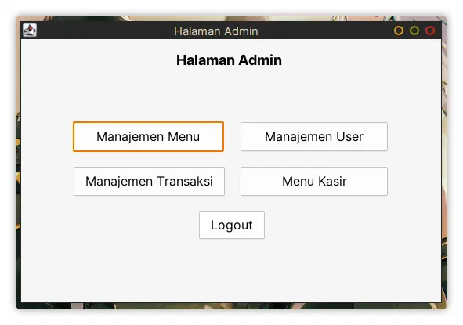

# Aplikasi Kasir Java

> disclaimer: This is my first time creating a Java Swing app and I don't enjoy
> writing Java at all, so please lower your expectation :p

> Also bare in mind that this app is still a work in progress so things below
> are subjects to change.

## What I use to make this app

- [Java](https://java.com/ja/) - The language itself
- [Swing](https://en.wikipedia.org/wiki/Swing_(Java)) - Java framework for building GUI
- [Gradle](https://gradle.org/) - The build tool
- [Oracle Netbeans IDE](https://www.oracle.com/tools/technologies/netbeans-ide.html) - I only used it for its GUI builder which is quite nice
- [Neovim](https://neovim.io/) - The text editor, I edit all of the code from here
- [MariaDB/MySQL](https://mariadb.org/) - The database
- [Docker](https://www.docker.com/) - To make my life easier when setting up the database and phpmyadmin
- [FlatLaf](https://www.formdev.com/flatlaf/) - Better look and feel for Java Swing
- [JasperReport](https://community.jaspersoft.com/project/jasperreports-library) - The library needed to get the receipt in form of image
- [Apache POI](https://poi.apache.org/) - The library needed to export the report to Excel file


## Database

Here's how the database laid out. (My own version compared to the original design)

|           My version             |               Original              |
| -------------------------------- | ----------------------------------- |
|  |  |

I changed it to only use 5 tables instead of 6 because the original design
doesn't make any sense to me.

Two of them (order & detail_order) are *very* similar and that would just over-complicate the query
(to me anyways, I don't want to query 2 tables just to find out that both of
them are pretty much the same)

## Screenshots

I'm still planning some things to make this complete, but most of them are done.


### Login


### Halaman Admin




### Halaman Kasir


### Manajemen Menu


### Manajemen User


## Manual

### Project Structure

Here's a project structure that will (hopefully) guide you to understand this app.

#### **app**
- **build.gradle** - This is where we declare the dependencies for this app.
- **src/main/java/kasir**
  - **App.java** - The entry point of the app
  - **controllers** - These files control the Create, Read, Update, and Delete operation for the models. (abstraction layer)
    - **FoodSource.java** - The `Food` controller (masakan)
    - **LevelSource.java** - The `Level` controller (level)
    - **OrderSource.java** - The `Order` controller (order)
    - **TransactionSource.java** - The `Transaction` controller (transaksi)
    - **UserSource.java** - The `User` controller (user)
  - **database** - Database related files
    - **ConnectionHelper.java** - Helper to get the database connection.
  - **helpers** - General utilities
    - **FormatRupiah.java** - Format a `long` value to a formatted `String` value and vice versa. Ex. `2000 -> Rp. 2000` and `Rp. 2000 -> 2000`
    - **OrderTable.java** - The *shared state* needed for the `Kasir` window.
    - **Popup.java** - Helper to spawn window popup easier.
    - **Receipt.java** - Get a receipt in form of an image, this depends on JasperReport.
    - **Report.java** - Get a report in form of an Excel file, this depends on Apache POI.
  - **models** - Where the model lives. Each model reflects a table in the database.
    - **Food.java** - The `Food` model (masakan)
    - **Level.java** - The `Level` model (level)
    - **Order.java** - The `Order` model (order)
    - **Transaction.java** - The `Transaction` model (transaksi)
    - **User.java** - The `User` model (user)
  - **reports**
    - **struk_pembayaran.jrxml** - This is the template for JasperReport.
  - **ui**
    - **Admin.java** - The `Admin` window where you can choose what you want to do.
    - **Kasir.java** - The `Kasir` window where you add a transaction by adding some orders.
    - **KasirPopup.java** - The `Kasir` popup, this is how you'd add an order.
    - **Login.java** - The `Login` window, this is the very first window you'd open.
    - **MenuManager.java** - The `MenuManager` window, this is where you manage the menu. (I should probably rename this?)
    - **MenuPopup.java** - The `MenuManager` popup, this is a form where you'd add a new *menu* or modify an existing *menu*.
    - **TransactionManager.java** - The `TransactionManager` window, this is where you manage transaction. (Getting a receipt, exporting a report, etc)
    - **TransactionPopup.java** - The `TransactionManager` popup, this is where you'd see the *orders* for each transaction.
    - **UserManager.java** - The `UserManager` window, this is where you'd manage the users of this app.
    - **UserPopup.java** - The `UserManager` popup, this is a form where you'd add a new *user* or modify an existing *user*.
    - **\*.form** - Form files needed for Netbeans GUI builder
- **gradlew** - Gradle Wrapper, this is how you'd run the tasks on Unix system (Linux, Mac, etc).
- **gradlew.bat** - Also a Gradle wrapper, but this one is for Windows.
- **kasir.sql** - This is the dump of the database to help you setup the database.

### How it works (briefly).

Here's some brief explanation on how it works.

- Login
  How this work is actually really simple. I don't use any hashing for the password (and that's probably not a good idea), but for the sake of simplicity, I chose not to use any.

  First, the code in `App.java` opens up a window which comes from `ui/Login.java`. You might notice there's a line which looks something like `Popup.<Login>open(new Login(), ...)`, we'll talk about that later.

  The logic is available inside the `ui/Login.java`. What it does is it gets the user's input, make a new instance of a user model (which is available from `User.java` file), and feed that model into the `UserSource.java` which is the controller for the user model. After that, it tries to find a user with the given username and password. If it doesn't found the user, it will throw an error by opening a popup window that tells the user what's going on and do a `return` from that point. Otherwise, it proceeds to the next piece of code.

  From here, we check the user's level ID that we've found from the database. Based on that level ID, we'd open different windows. Ex: 1 will open Admin window, 2 will open Cashier window, so on and so forth.

  It will also pass the current window reference and the current user to the next window so the next window will have some information about what to do when the user press logout, who is currently using it, etc.

  That's pretty much it. Nothing crazy because this is just a simple app.

- Logout
  This feature is *very* easy to implement. How it works is it close the current window by doing `this.dispose()` or `dispose()`, and it will open the Login window again.

- Admin Page
  The main admin page is really simple. It only consists of several buttons that opens another window if pressed. That's it.

- Cashier Page (Kasir)
  This page is probably the most difficult one for me to implement because this is one of the very first page that I made in this app so I haven't got the hang of it.

  How it works is actually quite simple though. You have 1 table for the orders and the side form in which you can fill out the details such as table number and the paid amount.

  If you're just a customer, you can only fill out the table number. But if you're the staff (admin, cashier, etc) then you can fill the paid amount.

  The table will stack duplicate item (although the logic behind this is *kinda* questionable) and it will calculate the amount properly.

  When you're done, you can press the confirm button and it will give you the option to print the receipt.

- User Manager Page (Manajemen User)
  This page manage the user and can only be accessed by the admin. If you want to add a new user, it will use a popup window to insert all of the user details.

---

Those are how this app work, pretty much. But here's a lower level concept that gets applied for this app.

- General Flow
  1. We create an instance of the model by filling it with the appropriate data.
  2. We feed the model to the controller
  3. When the controller receives an instance of the model and gets instantiated, it can do a basic CRUD operation. There are differences on some controllers that other controllers don't have like `findByID`, `findByTransactionID`, etc. But those are some minor differences, the logic stays the same, instead of using the model instance, we'd use the parameter of that function. Because we don't rely on the instance of the model, we can make these functions as static.
  4. Repeat this logic and change them if needed :)

- Helper Classes
  - **Popup**
    This class *helps* us to open a new popup window with the appropriate properties like `setLocationRelativeTo`, `setResizable`, etc so we don't repeat ourself. It looks cleaner too!

  - **FormatRupiah**
    We use this class to format the given number to the appropriate rupiah currency format and vice versa. It utilises `java.text.DecimalFormat` and `java.text.DecimalFormatSymbols` for converting it to the formatted number and a simple regex to normalise the formatted number.

  - **OrderTable**
    This class act as a *store* for the order table. It stores the list of rows using an `ArrayList`. The data will look something like this (in JSON representation)

    ```
    [
      ["ORDER_ID_1", "ORDER_NAME_1", "ORDER_PRICE_1", "ETC"],
      ["ORDER_ID_2", "ORDER_NAME_2", "ORDER_PRICE_2", "ETC"],
      ["ORDER_ID_3", "ORDER_NAME_3", "ORDER_PRICE_3", "ETC"],
      ["ORDER_ID_4", "ORDER_NAME_4", "ORDER_PRICE_4", "ETC"],
    ]
    ```

    It pretty much looks like a table.

  - **Receipt**
    This class is where the `JasperReport` library gets used. It's pretty much self explanatory, I've added some comments there to (hopefully) help you out :)

  - **Report**
    This class takes care of the report using `Apache POI`. It exports the given data to an `.xlsx` file format. It's also self explanatory and I also add some comments there, feel free to explore it yourself.

  - **Database**
    It's used to get the connection to the database so we don't need to repeatedly fill out the data needed to connect to the database. It's also quite simple.
