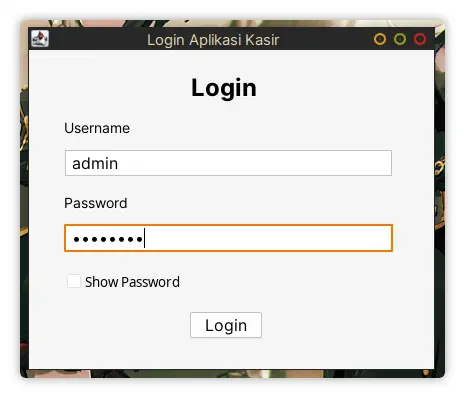
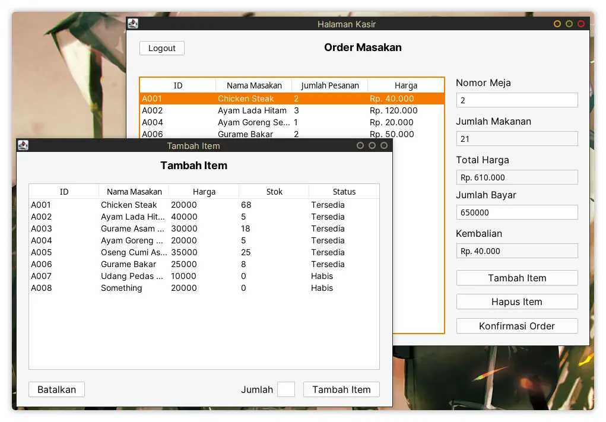
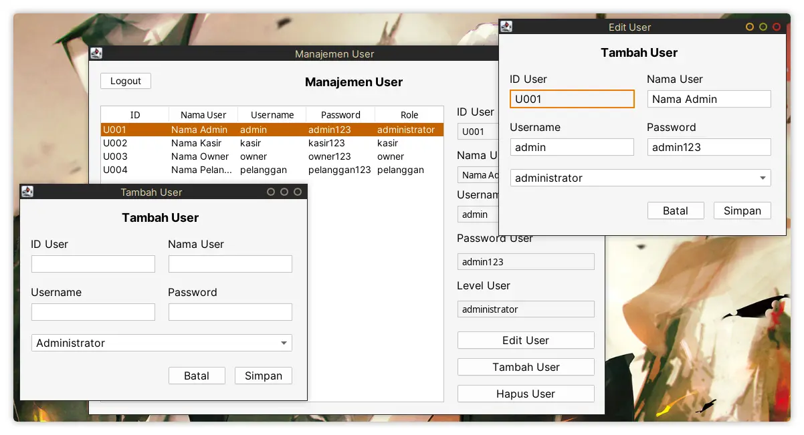

# Aplikasi Kasir Java

> disclaimer: This is my first time creating a Java Swing app and I don't enjoy
> writing Java at all, so please lower your expectation :p

> Also bare in mind that this app is still a work in progress so things below
> are subjects to change.

## What I use to make this app

- [Java](https://java.com/ja/) - The language itself
- [Swing](https://en.wikipedia.org/wiki/Swing_(Java)) - Java framework for building GUI
- [Gradle](https://gradle.org/) - The build tool
- [Oracle Netbeans IDE](https://www.oracle.com/tools/technologies/netbeans-ide.html) - I only used it for its GUI builder which is quite nice
- [Neovim](https://neovim.io/) - The text editor, I edit all of the code from here
- [MariaDB/MySQL](https://mariadb.org/) - The database
- [Docker](https://www.docker.com/) - To make my life easier when setting up the database and phpmyadmin
- [FlatLaf](https://www.formdev.com/flatlaf/) - Better look and feel for Java Swing

## Database

Here's how the database laid out. (My own version compared to the original design)

|           My version             |               Original              |
| -------------------------------- | ----------------------------------- |
|  |  |

I changed it to only use 5 tables instead of 6 because that doesn't make any
sense to me.

Two of them are *very* similar and that would just over-complicate the query
(to me anyways, I don't want to query 2 tables just to find out that both of
them are pretty much the same)

## Screenshots

I'm still planning some things to make this complete, but most of them are done.

### Login

### Halaman Kasir

### Manajemen Menu

### Manajemen User

## Manual

TBD

> Soon-ish when I finish this app :p
